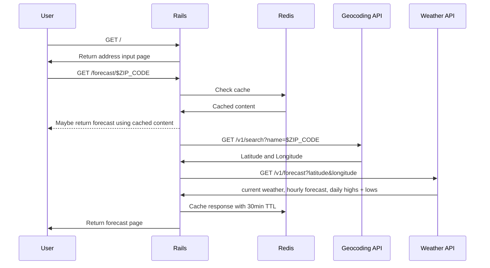

# Take Home Interview, Jan 2023, Apple

## Plan of Attack

Plan B:
- Find Weather API to translate latitudes and longitudes into temperatures
    https://open-meteo.com/
- Find Address API to translate addresses into latitudes and longitudes
    google maps geocoding api

The prompt is clear, the app must use Ruby on Rails and return weather forecast
data for an address. Caching is on the zip code level, and there are bonus
points for displaying high/low temps and extended forecasts. I'm going to
prompt users to use city name or zip code. I'm assuming the creators of this
take home meant to limit this to weather within the USA. They used the term
"zip code" in the prompt, an american creation only used within the United
States and associated territories.

I found a good open weather API, open-meteo.com. I can requests for weather
based on the latitude and longitude using the following format:

```sh
curl "https://api.open-meteo.com/v1/forecast"\
"?latitude=$LAT"\
"&longitude=$LON"\
"&current_weather=true"
# See Appendix, Response A
```

My other problem is that I need to translate an address into a latitude and
longitude. This is called geocoding. I haven't been able to find any freely
available geocoding APIs online, but after exploring open-meteo.com with the
console open, I noticed they have an unadvertised geocoding api I can use that
accepts a name parameter which can be a city name or a zip code:

```sh
curl "https://geocoding-api.open-meteo.com/v1/search"\
"?name=$ZIP_OR_CITY"
# See Appendix, Response B
```

To fulfill the bonus requirements of high/low temp, I can provide a "daily"
parameter and specify it to return min and max temperatures for the next week.
It requires me to specify a timezone though, which I'll get from the geocoding
API. Caching the API response by zipcode shouldn't be affected by this timezone
parameter, I believe it's a safe assumption for this project that every zip
code will have the same timezone. 

```sh
curl "https://api.open-meteo.com/v1/forecast"\
"?latitude=$LAT"\
"&longitude=$LON"\
"&timezone=$TIMEZONE"\
"&current_weather=true"\
"&daily=temperature_2m_min"\
"&daily=temperature_2m_max"
```

To fullfill the other bonus requirements of a temperature forecast, I can
provide an "hourly" parameter, and specify it to return surface temperatures
for every hour in the next week.

```sh
curl "https://api.open-meteo.com/v1/forecast"\
"?latitude=$LAT"\
"&longitude=$LON"\
"&timezone=$TIMEZONE"\
"&current_weather=true"\
"&daily=temperature_2m_min"\
"&daily=temperature_2m_max"\
"&hourly=temperature_2m"
```

I'm thankful I found these two open APIs, otherwise I would need an API key
from a paid service. I would not like to manage secrets tied to my credit card
for what is a small take-home interview that will be perused by strangers. To
run the project, they would need access to the secrets 😱, which means
encrypting them with SOPS and providing a shared key, or deploying, both too
much trouble right now.

We should have all the API data we need to fulfill the requirements of the
project. Now we just need to understand what the request flow will look like,
where caching fits into that, and what data model we may need, if any. Then we
can put the final UI together and make things as pretty as needed.

I'm going to limit user input to zip codes only right now, it creates the
simplest request flow and is a quick path to an MVP. To allow a user to put in
city names means creating separate cache keys for cities vs zips, as cities are
composites of multiple zip codes with a different latitude and longitude. The
website would also need to provide an autocomplete form or some other type of
UI pattern to let the user specify which city name they mean so I can resolve
their input text to a single entity. With a zip code it's easy, they type in
five numbers and it's already resolved to a single cacheable entity while
meeting the requirements of the prompt.

From the users perspective, the request flow will look like:



The user will see two pages: the address input page, containing a form with a text input and submit button, and the forecast page, summarizing the weather information in a simple stacked layout that provides a link back to the address input page and indicates whether the forecast is cached.

We'll put our infrastructure together using Docker, for ease of use and so our interviewers can quickly get it running locally. We will need a Rails app, a PostgreSQL database, and Redis instance. I'll proxy requests with Nginx. I will store commands for project development and maintenance in an executable file "cli" at the root of the repo.

TODO: start proxying with nginx

## Future Improvements

- Widen input range from just zip code to city names. Autocomplete user input
and require selecting one option so search text is resolved to one entity.
- Put API scraping on workers so user is not left hanging until all requests
resolve, can poll or do websockets until data is available.

## Appendix

### A) Response from forecast

```json
{
	"latitude": 40.710335,
	"longitude": -73.99307,
	"generationtime_ms": 0.32508373260498047,
	"utc_offset_seconds": 0,
	"timezone": "GMT",
	"timezone_abbreviation": "GMT",
	"elevation": 51.0,
	"current_weather": {
		"temperature": 2.4,
		"windspeed": 11.3,
		"winddirection": 22.0,
		"weathercode": 0,
		"time": "2023-01-08T16:00"
	}
}
```

### B) Response from geocoding

```json
{
	"results": [
		{
			"id": 5128581,
			"name": "New York",
			"latitude": 40.71427,
			"longitude": -74.00597,
			"elevation": 10.0,
			"feature_code": "PPL",
			"country_code": "US",
			"admin1_id": 5128638,
			"timezone": "America/New_York",
			"population": 8175133,
			"postcodes": [
				"10001",
				"10002",
				"10003",
				"10004",
				"10005",
				"10006",
				"10007",
				"10008",
				"10009",
				"10010",
				"10011",
				"10012",
				"10013",
				"10014",
				"10016",
				"10017",
				"10018",
				"10019",
				"10020",
				"10021",
				"10022",
				"10023",
				"10024",
				"10025",
				"10026",
				"10027",
				"10028",
				"10029",
				"10030",
				"10031",
				"10032",
				"10033",
				"10034",
				"10035",
				"10036",
				"10037",
				"10038",
				"10039",
				"10040",
				"10041",
				"10043",
				"10044",
				"10045",
				"10055",
				"10060",
				"10065",
				"10069",
				"10080",
				"10081",
				"10087",
				"10090",
				"10101",
				"10102",
				"10103",
				"10104",
				"10105",
				"10106",
				"10107",
				"10108",
				"10109",
				"10110",
				"10111",
				"10112",
				"10113",
				"10114",
				"10115",
				"10116",
				"10117",
				"10118",
				"10119",
				"10120",
				"10121",
				"10122",
				"10123",
				"10124",
				"10125",
				"10126",
				"10128",
				"10129",
				"10130",
				"10131",
				"10132",
				"10133",
				"10138",
				"10150",
				"10151",
				"10152",
				"10153",
				"10154",
				"10155",
				"10156",
				"10157",
				"10158",
				"10159",
				"10160",
				"10161",
				"10162",
				"10163",
				"10164",
				"10165",
				"10166",
				"10167",
				"10168",
				"10169",
				"10170",
				"10171",
				"10172",
				"10173",
				"10174",
				"10175",
				"10176",
				"10177",
				"10178",
				"10179",
				"10185",
				"10199",
				"10203",
				"10211",
				"10212",
				"10213",
				"10242",
				"10249",
				"10256",
				"10258",
				"10259",
				"10260",
				"10261",
				"10265",
				"10268",
				"10269",
				"10270",
				"10271",
				"10272",
				"10273",
				"10274",
				"10275",
				"10276",
				"10277",
				"10278",
				"10279",
				"10280",
				"10281",
				"10282",
				"10285",
				"10286"
			],
			"country_id": 6252001,
			"country": "United States",
			"admin1": "New York"
		}
	],
	"generationtime_ms": 0.29802322
}
```

### C) Response with bonus info

```json
{
	"latitude": 40.710335,
	"longitude": -73.99307,
	"generationtime_ms": 0.40793418884277344,
	"utc_offset_seconds": -18000,
	"timezone": "America/New_York",
	"timezone_abbreviation": "EST",
	"elevation": 51.0,
	"current_weather": {
		"temperature": 3.0,
		"windspeed": 4.4,
		"winddirection": 35.0,
		"weathercode": 3,
		"time": "2023-01-08T12:00"
	},
	"hourly_units": {
		"time": "iso8601",
		"temperature_2m": "°C"
	},
	"hourly": {
		"time": [
			"2023-01-08T00:00",
			"2023-01-08T01:00",
			"2023-01-08T02:00",
			"2023-01-08T03:00",
			"2023-01-08T04:00",
			"2023-01-08T05:00",
			"2023-01-08T06:00",
			"2023-01-08T07:00",
			"2023-01-08T08:00",
			"2023-01-08T09:00",
			"2023-01-08T10:00",
			"2023-01-08T11:00",
			"2023-01-08T12:00",
			"2023-01-08T13:00",
			"2023-01-08T14:00",
			"2023-01-08T15:00",
			"2023-01-08T16:00",
			"2023-01-08T17:00",
			"2023-01-08T18:00",
			"2023-01-08T19:00",
			"2023-01-08T20:00",
			"2023-01-08T21:00",
			"2023-01-08T22:00",
			"2023-01-08T23:00",
			"2023-01-09T00:00",
			"2023-01-09T01:00",
			"2023-01-09T02:00",
			"2023-01-09T03:00",
			"2023-01-09T04:00",
			"2023-01-09T05:00",
			"2023-01-09T06:00",
			"2023-01-09T07:00",
			"2023-01-09T08:00",
			"2023-01-09T09:00",
			"2023-01-09T10:00",
			"2023-01-09T11:00",
			"2023-01-09T12:00",
			"2023-01-09T13:00",
			"2023-01-09T14:00",
			"2023-01-09T15:00",
			"2023-01-09T16:00",
			"2023-01-09T17:00",
			"2023-01-09T18:00",
			"2023-01-09T19:00",
			"2023-01-09T20:00",
			"2023-01-09T21:00",
			"2023-01-09T22:00",
			"2023-01-09T23:00",
			"2023-01-10T00:00",
			"2023-01-10T01:00",
			"2023-01-10T02:00",
			"2023-01-10T03:00",
			"2023-01-10T04:00",
			"2023-01-10T05:00",
			"2023-01-10T06:00",
			"2023-01-10T07:00",
			"2023-01-10T08:00",
			"2023-01-10T09:00",
			"2023-01-10T10:00",
			"2023-01-10T11:00",
			"2023-01-10T12:00",
			"2023-01-10T13:00",
			"2023-01-10T14:00",
			"2023-01-10T15:00",
			"2023-01-10T16:00",
			"2023-01-10T17:00",
			"2023-01-10T18:00",
			"2023-01-10T19:00",
			"2023-01-10T20:00",
			"2023-01-10T21:00",
			"2023-01-10T22:00",
			"2023-01-10T23:00",
			"2023-01-11T00:00",
			"2023-01-11T01:00",
			"2023-01-11T02:00",
			"2023-01-11T03:00",
			"2023-01-11T04:00",
			"2023-01-11T05:00",
			"2023-01-11T06:00",
			"2023-01-11T07:00",
			"2023-01-11T08:00",
			"2023-01-11T09:00",
			"2023-01-11T10:00",
			"2023-01-11T11:00",
			"2023-01-11T12:00",
			"2023-01-11T13:00",
			"2023-01-11T14:00",
			"2023-01-11T15:00",
			"2023-01-11T16:00",
			"2023-01-11T17:00",
			"2023-01-11T18:00",
			"2023-01-11T19:00",
			"2023-01-11T20:00",
			"2023-01-11T21:00",
			"2023-01-11T22:00",
			"2023-01-11T23:00",
			"2023-01-12T00:00",
			"2023-01-12T01:00",
			"2023-01-12T02:00",
			"2023-01-12T03:00",
			"2023-01-12T04:00",
			"2023-01-12T05:00",
			"2023-01-12T06:00",
			"2023-01-12T07:00",
			"2023-01-12T08:00",
			"2023-01-12T09:00",
			"2023-01-12T10:00",
			"2023-01-12T11:00",
			"2023-01-12T12:00",
			"2023-01-12T13:00",
			"2023-01-12T14:00",
			"2023-01-12T15:00",
			"2023-01-12T16:00",
			"2023-01-12T17:00",
			"2023-01-12T18:00",
			"2023-01-12T19:00",
			"2023-01-12T20:00",
			"2023-01-12T21:00",
			"2023-01-12T22:00",
			"2023-01-12T23:00",
			"2023-01-13T00:00",
			"2023-01-13T01:00",
			"2023-01-13T02:00",
			"2023-01-13T03:00",
			"2023-01-13T04:00",
			"2023-01-13T05:00",
			"2023-01-13T06:00",
			"2023-01-13T07:00",
			"2023-01-13T08:00",
			"2023-01-13T09:00",
			"2023-01-13T10:00",
			"2023-01-13T11:00",
			"2023-01-13T12:00",
			"2023-01-13T13:00",
			"2023-01-13T14:00",
			"2023-01-13T15:00",
			"2023-01-13T16:00",
			"2023-01-13T17:00",
			"2023-01-13T18:00",
			"2023-01-13T19:00",
			"2023-01-13T20:00",
			"2023-01-13T21:00",
			"2023-01-13T22:00",
			"2023-01-13T23:00",
			"2023-01-14T00:00",
			"2023-01-14T01:00",
			"2023-01-14T02:00",
			"2023-01-14T03:00",
			"2023-01-14T04:00",
			"2023-01-14T05:00",
			"2023-01-14T06:00",
			"2023-01-14T07:00",
			"2023-01-14T08:00",
			"2023-01-14T09:00",
			"2023-01-14T10:00",
			"2023-01-14T11:00",
			"2023-01-14T12:00",
			"2023-01-14T13:00",
			"2023-01-14T14:00",
			"2023-01-14T15:00",
			"2023-01-14T16:00",
			"2023-01-14T17:00",
			"2023-01-14T18:00",
			"2023-01-14T19:00",
			"2023-01-14T20:00",
			"2023-01-14T21:00",
			"2023-01-14T22:00",
			"2023-01-14T23:00"
		],
		"temperature_2m": [
			2.0,
			1.7,
			1.0,
			0.3,
			0.1,
			-0.4,
			-0.4,
			-0.7,
			-0.7,
			0.7,
			2.1,
			2.4,
			3.0,
			3.7,
			4.1,
			3.7,
			3.2,
			1.4,
			0.3,
			-0.2,
			-0.4,
			-0.3,
			0.2,
			-0.1,
			-0.0,
			0.0,
			0.8,
			1.2,
			1.2,
			0.9,
			0.7,
			0.8,
			0.8,
			1.2,
			2.1,
			3.3,
			4.6,
			5.7,
			5.7,
			5.2,
			4.1,
			2.2,
			1.0,
			0.3,
			-0.2,
			-0.2,
			-0.3,
			-0.3,
			-0.3,
			-0.2,
			-0.2,
			-0.1,
			-0.1,
			-0.2,
			-0.1,
			-0.2,
			1.7,
			2.3,
			3.4,
			4.6,
			5.5,
			6.1,
			6.2,
			6.3,
			6.2,
			5.6,
			5.3,
			4.9,
			4.6,
			4.4,
			4.2,
			4.0,
			3.7,
			3.5,
			3.4,
			2.9,
			2.4,
			2.0,
			1.7,
			1.4,
			1.4,
			2.4,
			3.5,
			4.4,
			5.1,
			5.4,
			5.7,
			5.8,
			5.6,
			5.2,
			4.9,
			4.6,
			4.5,
			4.5,
			4.5,
			4.5,
			4.0,
			3.9,
			3.7,
			3.7,
			3.5,
			3.6,
			3.6,
			4.0,
			4.1,
			4.4,
			4.9,
			5.4,
			6.2,
			6.6,
			6.7,
			6.6,
			6.5,
			6.8,
			7.7,
			8.4,
			8.8,
			9.0,
			9.5,
			9.8,
			9.8,
			10.1,
			10.4,
			10.8,
			11.3,
			11.5,
			11.7,
			11.8,
			11.6,
			11.2,
			11.1,
			11.8,
			12.8,
			13.7,
			13.5,
			12.9,
			11.8,
			10.8,
			9.5,
			8.0,
			7.2,
			6.7,
			6.0,
			5.5,
			5.0,
			4.4,
			4.0,
			3.8,
			3.4,
			3.1,
			2.6,
			2.3,
			2.4,
			2.6,
			3.0,
			3.3,
			3.8,
			4.2,
			4.4,
			4.5,
			4.2,
			3.5,
			2.5,
			1.4,
			1.0,
			0.6,
			0.3,
			0.1
		]
	},
	"daily_units": {
		"time": "iso8601",
		"temperature_2m_max": "°C",
		"temperature_2m_min": "°C"
	},
	"daily": {
		"time": [
			"2023-01-08",
			"2023-01-09",
			"2023-01-10",
			"2023-01-11",
			"2023-01-12",
			"2023-01-13",
			"2023-01-14"
		],
		"temperature_2m_max": [
			4.1,
			5.7,
			6.3,
			5.8,
			9.8,
			13.7,
			5.0
		],
		"temperature_2m_min": [
			-0.7,
			-0.3,
			-0.3,
			1.4,
			3.5,
			5.5,
			0.1
		]
	}
}
```
